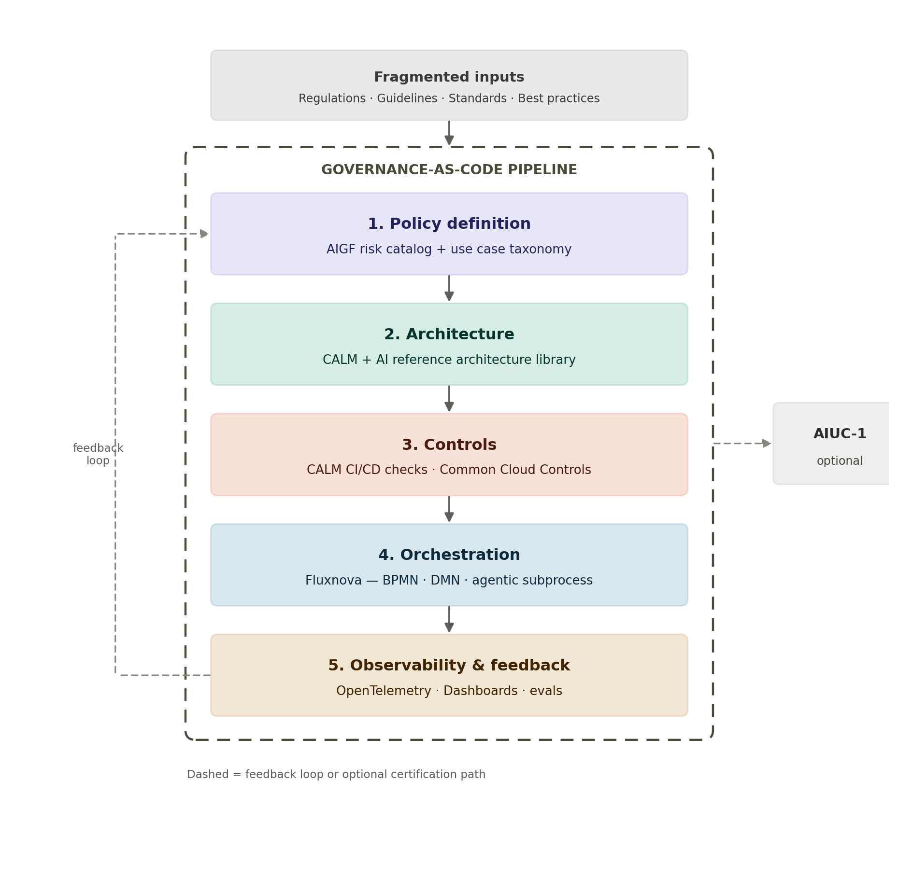

# Chapter 1 — Governance-as-Code, in One Sentence

Agentic AI systems — agents calling tools, invoking MCP servers, making autonomous decisions — move and change far faster than traditional manual, siloed governance can track. The raw material an FSI organization actually starts from is fragmented: regulations, industry guidelines, technical standards, and best practices scattered across dozens of sources, none of them machine-readable and none of them talking to each other. FINOS's answer is to turn that fragmented landscape into something machine-readable and runtime-observable: an end-to-end pipeline covering policy definition, architecture, controls, orchestration, and observability, feeding back on itself as a continuous loop. Instead of governance being a document engineers consult and a checklist compliance signs off on, it becomes something that runs alongside the code — checked automatically, continuously, and with evidence generated as a byproduct rather than a separate task.

That pipeline is assembled from several open-source FINOS projects working together. AIGF sits at the center as the thing that defines *what* to govern, while the surrounding tools handle *how* that gets enforced and observed.

## 1.1 The Pipeline at a Glance

Before going stage by stage, it helps to see the whole shape at once. Fragmented inputs feed into five connected stages, with a feedback loop closing back to policy definition, and an optional branch out to external certification once internal governance is mature:

*Figure 1. The Governance-as-Code pipeline as a bordered whole: fragmented inputs feed the pipeline, five stages run inside it with a continuous feedback loop, and AIUC-1 certification attaches to the pipeline itself rather than to any single stage.*

Reading the diagram: the dashed border is the important addition here, and it's deliberate — it marks the Governance-as-Code pipeline as a single, bounded whole, not a loose sequence of independent stages. Two things attach to that border rather than to any one stage inside it. At the top, fragmented inputs — regulations, industry guidelines, technical standards, and internal best practices, none of them arriving in a form a pipeline can consume directly — feed into the pipeline as a whole; policy definition is where that synthesis actually happens, but the raw material is something the entire pipeline exists to digest, not something Step 1 alone consumes in isolation. On the right, AIUC-1 attaches to the same border rather than branching off orchestration or any other single stage, because certification isn't an audit of one component — it's an assessment of what the governed pipeline, taken together, actually produces. Inside the border, the five stages run in their usual order: policy definition's risk catalog and taxonomy flow into architecture's CALM specifications, which split into two distinct concerns — controls, where CI/CD checks and Common Cloud Controls enforce policy automatically against every change, and orchestration, where Fluxnova actually executes the agentic process within the boundaries those controls require. The running system is then watched continuously in observability and feedback, and what's learned there flows back up into policy definition, closing the loop entirely inside the pipeline's own border. AIUC-1 remains outside that loop by design — a deliberate, optional step an FSI organization takes once the internal pipeline has already produced the evidence to support it, covered in full in Chapter 6.

## 1.2 Pipeline Components and Tools

The pipeline isn't one product — it's a set of open-source FINOS projects, each responsible for one part of the flow. The table below lays out every component referenced in this guide, which stage it belongs to, and what it actually does.

| **Stage**                | **Component / tool**                          | **Role in the pipeline**                                                                                                                                                                          |
|--------------------------|-----------------------------------------------|---------------------------------------------------------------------------------------------------------------------------------------------------------------------------------------------------|
| Policy definition        | **AIGF Risk & Mitigation Catalog**            | The core set of financial-services-specific AI and agentic risks, each paired with concrete mitigations, mapped to frameworks like NIST, OWASP, and the EU AI Act.                                |
| Policy definition        | **AIGF Use Cases Taxonomy**                   | Classifies AI systems by type, architecture pattern, and data handling needs, so risk and controls scale to what a system actually does.                                                          |
| Architecture             | **AI Reference Architecture Library**         | Pre-vetted, composable architecture patterns (single agent, multi-agent, tool-using agents) with security and oversight boundaries designed in.                                                   |
| Architecture             | **CALM (Common Architecture Language Model)** | Expresses reference architectures and AIGF policy as machine-readable, executable specifications — the bridge between regulatory language and actual code.                                        |
| Controls                 | **CALM CI/CD integration**                    | Embeds compliance checks directly into build pipelines, continuously validating agents and orchestration logic against AIGF-defined policy.                                                       |
| Controls                 | **Common Cloud Controls (CCC)**               | Extends governance into the infrastructure layer, mapping regulatory expectations to actionable technical controls for cloud and hybrid AI workloads.                                             |
| Orchestration            | **Fluxnova**                                  | BPMN/DMN-based orchestration engine that pins down deterministic process boundaries and decision logic around non-deterministic agent behavior, with full execution tracing.                      |
| Observability & feedback | **OpenTelemetry**                             | Open instrumentation standard capturing real-time traces, metrics, and logs from running agents.                                                                                                  |
| Observability & feedback | **Dashboards (e.g. Grafana)**                 | Visualizes observability data — behavior, cost, execution traces — as live operational and compliance signal.                                                                                     |
| Observability & feedback | **Evals**                                     | Continuous evaluation of agent behavior in production, feeding results back into the risk profile and, where relevant, back into AIGF itself.                                                     |
| Cross-cutting            | **FINOS AIGF MCP Server**                     | Turns requirements documents and architectural descriptions into governed, in-workflow guidance by connecting an AI agent directly to the taxonomy and risk catalog.                              |
| Cross-cutting            | **FINOS AI Fund**                             | The FSI-led funding and strategic-direction body (launched June 2026) backing AIGF and the rest of the Governance-as-Code pipeline.                                                               |
| External (optional)      | **AIUC-1**                                    | An independent, insured, adversarially-tested certification an FSI organization can pursue for specific high-risk or customer-facing agents once internal governance is in place — see Chapter 6. |

A few things worth noting about this list. First, nothing here is proprietary — every component is open source, governed collaboratively by FINOS member institutions, which is the central theme of this guide (see the Introduction). Second, the components are additive, not exclusive: an FSI organization doesn't have to adopt all of them on day one to get value — starting with the AIGF risk catalog and taxonomy alone (Chapter 9 walks through exactly how) already produces a usable governance program, with CALM, CCC, Fluxnova, and the observability layer added as the engineering pipeline matures. Third, AIUC-1 is listed as external and optional deliberately — it's not part of the Governance-as-Code pipeline itself, but a certification an FSI organization can layer on top of it, as Chapter 6 explains in detail.
