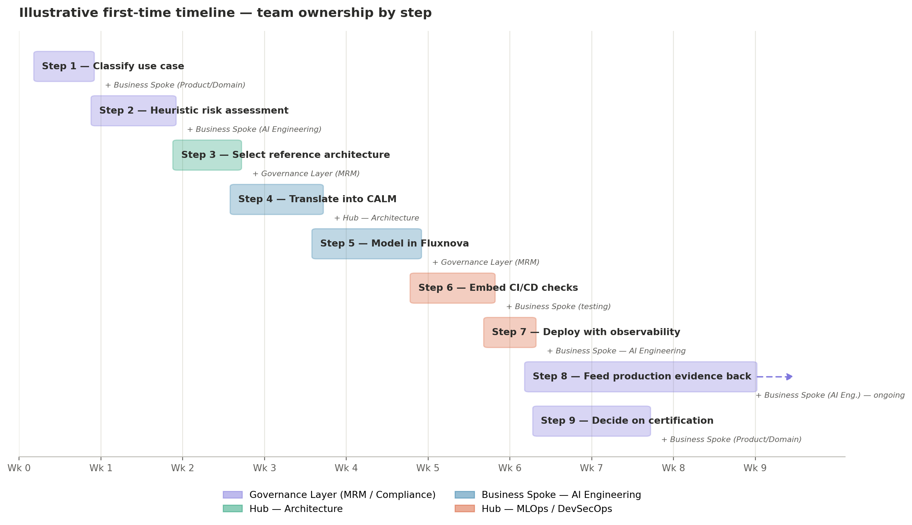
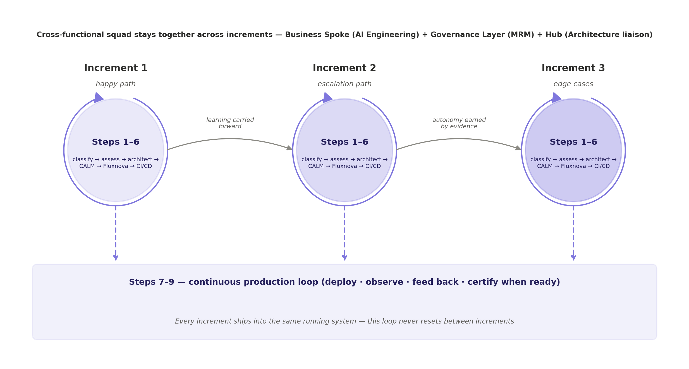

<!--
SPDX-License-Identifier: CC-BY-4.0
Copyright 2026 Fintech Open Source Foundation
-->

# Chapter 7 — A Step-by-Step Path Through the Pipeline

All of this can sound abstract until you walk through it as a sequence. Here's how an FSI organization actually moves a new agentic use case from idea to governed, running system, starting where AIGF itself starts: classification.

## 7.1 Teams and Roles

Chapters 4 and 5 used simple shorthand — “Engineering,” “GRC” — to keep the focus on what changes about the work itself. In a real FSI organization, that shorthand maps onto a specific and fairly consistent organizational pattern, and it's worth being precise about it before walking through who does what at each step.

FSI organizations rarely organize AI work into a single department. Because financial services is regulated and deeply specialized, most institutions use a hub-and-spoke model that splits AI talent across three groups:

- **The Hub — a central AI Center of Excellence.** A single technology unit, usually reporting to a Chief Data and Analytics Officer or Head of AI, that serves the whole institution without building any one business line's product. In this guide's pipeline, the Hub is who owns the reference architecture library and CALM patterns (Section 4.1), and who builds and operates the CI/CD integration, Common Cloud Controls, and the observability layer (Chapters 1 and 2) — standardized once, centrally, and reused by every business line rather than rebuilt for each use case.

- **The Spokes — embedded AI squads inside each business line.** Cross-functional teams sitting inside retail and digital banking, risk and corporate lending, financial crime and fraud, or treasury and operations, each with the domain knowledge to build the actual use case. A Spoke's product manager and domain expert own the business justification and the go-live decision; a Spoke's AI engineers write the CALM specification and the Fluxnova process definition for their own use case, building on what the Hub provides rather than standing up their own infrastructure. When Chapters 9 and 10 develop a document-review use case, that work sits inside a Spoke — plausibly the financial crime and fraud team, given the use case.

- **The Governance Layer — sitting horizontally across both.** This is worth splitting into two distinct functions rather than treating as one “GRC” block, because they check different things: **Model Risk Management (MRM)** is an independent second-line function that validates and stress-tests a model's technical behavior before it reaches production — the audience for the heuristic risk assessment in Step 2 and the DMN table review in Step 5. **Legal, Compliance & Ethics** checks regulatory alignment, bias, and data-privacy entitlements — the audience for the taxonomy classification in Step 1 and the certification decision in Step 9. A use case can clear MRM's technical validation and still need a Compliance sign-off on a point neither team's charter covers alone.

Four labels carry through the rest of this chapter: **Hub — Architecture**, **Hub — MLOps / DevSecOps**, **Business Spoke — AI Engineering** (paired with a Spoke's Product/Domain owner where the task is a business decision rather than a technical one), and **Governance Layer**, split into MRM and Compliance where the distinction matters. There's no standalone QA label — testing the pipeline itself falls to Hub MLOps, while testing the specific use case's behavior falls to the Spoke's AI engineers, which is where that work actually happens in this structure.

This structure is also exactly why Governance-as-Code matters in the way Chapter 1 argued. A hub-and-spoke model run without it tends to produce precisely the pitfalls the Introduction opened with: Spokes moving fast but reinventing risk assessment independently, or the Hub becoming a bottleneck reviewing every Spoke's bespoke approach one at a time. With AIGF's taxonomy, risk catalog, and reference architectures standardized once at the Hub and the Governance Layer, every Spoke reuses the same artifacts instead of negotiating its own — which is what lets the FSI organization, in the framing from the Introduction, innovate quickly at the edge while staying compliant at the core.

## 7.2 An Illustrative Timeline

The chart below shows one realistic timeline for a first-time use case moving through all nine steps, with the team primarily driving each one. It's illustrative, not a commitment — a simpler use case compresses this considerably, and Chapter 9's point about reuse holds here too: an FSI organization's second and third use cases move faster than this because the taxonomy, risk catalog, and reference architectures this timeline assumes are being built from scratch are already sitting there the second time around.

*Figure 3. An illustrative first-time timeline. Bars show a step's primary drive time; italic labels note the main supporting team. Steps 8 and 9 begin once the system is live and run in parallel with each other.*

A few things the chart is deliberately showing. Steps overlap rather than running strictly in sequence — Step 3's architecture selection is still being finalized as Step 4's CALM authoring begins, because in practice a team drafts the specification against a near-final architecture rather than waiting for a formal sign-off email. Step 8 (production feedback) is drawn as ongoing, with no end date, because it isn't a task that finishes — it's the steady state the system lives in from launch onward, which is precisely the point made in Chapter 1's feedback loop and Chapter 5's discussion of production monitoring. Step 9 (the certification decision) overlaps with the start of Step 8 rather than waiting for it, since the evidence needed for that decision starts accumulating the moment the system goes live.

## 7.3 Iterative Delivery, Not a Cascade

Figure 3 draws Steps 1 through 6 as a single relay for the whole use case: a full risk assessment, then a full architecture, then a full CALM specification, and so on, each waiting on the last. That's a fair way to explain what each step produces, but taken literally as a project plan it's a heavy commitment — anything the team learns late means walking back up the chain. Steps 7 through 9 already avoid this: Step 8 has no end date, and Step 9 overlaps with Step 8's start rather than waiting for it. The same thinking extends naturally to Steps 1 through 6, and it's worth spelling out how.

The shift is to slice the use case by behavior rather than by phase. Instead of fully specifying the entire use case before writing any CALM or Fluxnova code, a team takes a thin behavioral slice — the happy path first, then the escalation path, then accumulated edge cases — and runs all six steps, in miniature, for that slice alone. Each pass is a small, complete loop: classify the slice, assess its risk, confirm the architecture still fits, extend the CALM specification, extend the Fluxnova process, and let CI/CD validate it — all before moving to the next slice.

*Figure 4. Iterative delivery: Steps 1–6 run as a small loop per behavioral increment, with shading indicating how much autonomy each increment has earned. Every increment ships into the same continuous Steps 7–9 production loop from Figure 3 — it never resets.*

Three things make this work in practice, each visible in the diagram:

- **The same squad runs every loop.** A cascade model matches a relay-race org chart — Hub Architecture finishes and hands off to the Spoke, which hands off to Hub MLOps, which hands off to Governance at the end. Iterative delivery instead wants a standing cross-functional squad — a Business Spoke AI engineer, a Governance Layer (MRM) reviewer, and a Hub Architecture liaison — sitting together for the duration and cycling through Steps 1–6 repeatedly, so Governance participates continuously rather than gating at the end. This is the practical form of the argument Section 5.2 already made about GRC's involvement spreading across the lifecycle.

- **Autonomy is earned by evidence, not assumed upfront.** Rather than fully specifying every DMN rule in Step 5 before anything ships, the first increment's decision table can start maximally conservative — effectively “escalate everything” — and later increments relax specific rules toward auto-clear only once Step 8's production evidence justifies it. The risk model itself gets built iteratively, which is arguably safer than designing it fully upfront, since autonomy only ever gets added where there's evidence to support it.

- **Steps 1 through 3 get fast with repetition.** Chapter 9's argument about the taxonomy and risk catalog being reusable infrastructure applies within a single use case's increments, not just across different use cases: the second and third increments' classification and architecture checks are quick confirmations that nothing has changed, not full workshops repeated from scratch.

Two things don't get to loosen just because delivery is iterative. Every increment still needs its classification and risk checkpoint, however brief — skipping Step 1's spirit to move faster is exactly the kind of shortcut the Introduction's pitfalls warned about. And every CALM or DMN change, no matter how small the increment, goes through the same version-controlled review as a full specification would; an informal, un-reviewed increment quietly erodes the audit trail Chapter 11 depends on. Certification (Step 9) also stays a genuine gate near the point a use case is considered ready — a system can't be partially certified — but because evidence has been accumulating continuously across increments rather than in one final phase, that decision is cheaper to make whenever the team reaches it.

## Step 1 — Classify the use case with the AIGF Use Cases Taxonomy.

Before anything is built, the use case gets placed against AIGF's taxonomy, which categorizes AI systems by type, architecture pattern, autonomy level, tool authority, and data-handling needs. An internal coding assistant with no customer data access sits in a very different risk band than an autonomous agent that can initiate payments or advise clients directly. Context shapes risk tolerance directly: an AI helping an internal developer can tolerate more error than one advising clients on investments.

- **Write the one-paragraph use case narrative** — Business Spoke (Product/Domain)

- **Run the taxonomy classification workshop** — Governance Layer — Compliance, with the Business Spoke and Hub Architecture present

- **Record the classification as a reviewable artifact** — Governance Layer — Compliance

## Step 2 — Run the heuristic assessment against the risk catalog.

With the use case classified, the team works through AIGF's eight-step heuristic assessment methodology, which walks systematically through what actually drives risk for that specific system: what data the system is trained on, what data flows in through prompts and queries, and what could plausibly come out. The output is a shortlist of which risks genuinely apply and which mitigations from the catalog address them.

- **Walk the eight-step heuristic methodology against the use case** — Governance Layer — MRM

- **Identify which catalog risks genuinely apply** — Governance Layer — MRM, with Business Spoke AI Engineering input on technical feasibility

- **Draft the mitigation mapping** — Governance Layer — MRM and Business Spoke AI Engineering jointly

## Step 3 — Select the matching reference architecture and threat model.

The taxonomy classification and risk assessment feed directly into FINOS's AI Reference Architecture Library. Because threat models vary by autonomy level, tool authority, and human-oversight pattern, the classification from Step 1 determines which pre-vetted architecture pattern the team should build from.

- **Match the taxonomy classification to a reference architecture pattern** — Hub — Architecture

- **Review the pattern's threat model against Step 2's risk shortlist** — Hub — Architecture and Governance Layer — MRM

- **Sign off on the architecture selection** — Hub — Architecture lead

## Step 4 — Translate the architecture into CALM specifications.

The chosen reference architecture gets expressed through CALM as a machine-readable, executable specification — the bridge between the regulatory-and-risk language of Steps 1–2 and the actual code the engineering team will write.

- **Author the CALM nodes and relationships (Section 4.1)** — Business Spoke — AI Engineering, with Hub — Architecture

- **Attach controls mapped to Step 2's mitigations** — Business Spoke — AI Engineering, reviewed by Governance Layer — MRM

- **Merge the CALM file through a standard pull-request review** — Business Spoke — AI Engineering

## Step 5 — Draw the deterministic boundaries and hand them to Fluxnova.

Using the risk assessment and architecture as a guide, the team identifies which parts of the workflow must be deterministic — mandatory approval gates, escalation thresholds, sanctions or compliance checks — and which parts can safely be left to the LLM's judgment. Those deterministic boundaries get modeled as BPMN process flows and DMN decision tables in Fluxnova.

- **Model the BPMN process — tasks, gateways, end states** — Business Spoke — AI Engineering

- **Author the DMN decision tables against signed-off outcomes** — Business Spoke — AI Engineering and Governance Layer (MRM and Compliance)

- **Configure the agentic ad-hoc subprocess (prompt, tools, restricted variables)** — Business Spoke — AI Engineering

- **Review the deterministic boundaries against Step 2's mitigations** — Governance Layer — MRM

## Step 6 — Embed compliance checks into CI/CD.

As engineering builds against the CALM specification, CALM-driven compliance checks run automatically in the CI/CD pipeline, continuously validating the emerging system against the AIGF-defined policies selected back in Step 2. Common Cloud Controls does the equivalent for the underlying cloud and infrastructure layer.

- **Wire CALM and Fluxnova validation into the build pipeline** — Hub — MLOps / DevSecOps

- **Define release gates that block on a control failure** — Hub — MLOps / DevSecOps, with Governance Layer — MRM

- **Test the pipeline against known-good and known-bad cases** — Hub — MLOps / DevSecOps, with Business Spoke AI Engineering for domain-specific cases

## Step 7 — Deploy with observability switched on from day one.

Once running, the system is monitored through the pipeline's observability layer — OpenTelemetry instrumentation feeding dashboards (Grafana being a common choice) — capturing real-time behavior, cost, and Fluxnova's execution traces of every workflow instance.

- **Instrument the system with OpenTelemetry** — Business Spoke — AI Engineering and Hub — MLOps / DevSecOps

- **Stand up dashboards for operational and compliance views** — Hub — MLOps / DevSecOps

- **Define evals and the drift thresholds that trigger a review** — Governance Layer — MRM and Business Spoke AI Engineering

- **Approve go-live** — Business Spoke (Product/Domain) and Governance Layer — Compliance

## Step 8 — Feed production evidence back into governance.

The observability data, execution traces, and any evals run in production feed back into the use case's risk profile, closing the loop. If the agent's behavior in production surfaces a risk the original assessment didn't anticipate, that goes back into Step 2 for reassessment — and, at the framework level, back into AIGF's own catalog through FINOS's open, collaborative maintenance process.

- **Monitor dashboards and evals on an ongoing basis** — Governance Layer — MRM, with Business Spoke AI Engineering

- **Triage any finding that falls outside expected behavior** — Governance Layer — MRM and Business Spoke AI Engineering

- **Update the risk mapping or DMN tables where warranted** — Governance Layer — MRM and Business Spoke AI Engineering

- **Consider contributing the finding back to AIGF (Chapter 9)** — Governance Layer — Compliance, with the Hub representing the FSI organization's wider interest

## Step 9 — Decide whether external certification is warranted.

With all of the above in place, the FSI organization is now in a strong position to make a deliberate call: does this specific use case warrant pursuing AIUC-1 certification on top of everything already governed internally? Because the reference architecture, CI/CD validation history, and execution traces already exist, this becomes a targeted decision layered on mature governance, not a scramble to produce evidence that was never being captured.

- **Assess whether the use case's risk profile warrants AIUC-1** — Governance Layer — Compliance and Business Spoke (Product/Domain)

- **Assemble the evidence package (CI/CD history, execution traces)** — Governance Layer — MRM and Hub — MLOps / DevSecOps

- **Engage an accredited auditor if pursuing certification** — Governance Layer — Compliance

The throughline across all nine steps is that nothing here is a one-off exercise. The taxonomy, the risk catalog, the architecture library, and the CI/CD checks all persist as reusable infrastructure — so the second use case an FSI organization runs through this pipeline moves faster than the first, and the fiftieth moves faster still.
