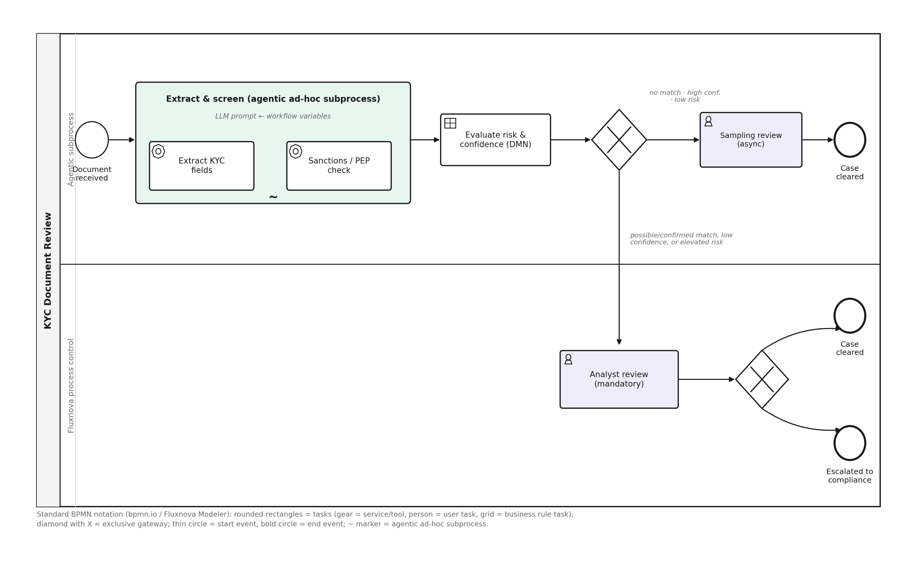

<!--
SPDX-License-Identifier: CC-BY-4.0
Copyright 2026 Fintech Open Source Foundation
-->

# Chapter 11 — Fluxnova in Depth: Modeling the KYC Process

Chapter 9 covered Step 1 of the nine-step path — codifying the KYC use case into a taxonomy classification, a risk shortlist, and a mitigation mapping, then contributing that artifact back to AIGF. This chapter picks up Step 5: turning those mitigations into an actual, running, enforced process. Fluxnova is where that happens, and because it's the component that ultimately determines whether the deterministic guarantees described in Chapter 3 hold in production, it deserves the same level of depth as Step 1.

## 11.1 From Mitigations to a Process Model

Recall the mitigations identified for the KYC use case in Chapter 9: mandatory human confirmation before any sanctions-adjacent case is cleared, a confidence threshold below which the agent must escalate rather than guess, and no ability for the agent to override a sanctions hit under any circumstance. Each of these is, in effect, a requirement for a specific enforcement point somewhere in the workflow. Fluxnova's job is to take that list of requirements and turn it into an explicit process definition — a BPMN diagram plus one or more DMN decision tables — where each mitigation corresponds to a concrete gateway, task boundary, or decision rule rather than an instruction the agent is merely asked to follow.

## 11.2 Two AI-Native Fluxnova Constructs

Everything in Section 11.1 could, in principle, be built with generic BPMN. What makes Fluxnova specifically suited to agentic workflows is two purpose-built constructs that connect the process layer directly to an LLM, without leaving the deterministic guarantees described in Chapter 3 at the door.

**The agentic ad-hoc subprocess.** This construct builds on Fluxnova 3.0's ad-hoc subprocess: a container of tasks with no fixed execution order. What makes the agentic variant different is who decides that order. At runtime, the engine queries an LLM; the LLM looks at the current business context and selects which of the subprocess's inner tasks to run, in whatever sequence and combination its reasoning calls for. Once selected, though, those tasks run exactly like any other workflow step — they are not a separate, informal side-channel the agent operates outside of, they are ordinary Fluxnova tasks with the engine's normal execution semantics.

Process authors configure the agent directly in the Fluxnova Modeler, not in code, which keeps the configuration itself reviewable alongside the rest of the process definition:

- **Provider and model** — which AI backend the subprocess calls.

- **System prompt** — the core goals and rules given to the agent for this subprocess.

- **Context variables** — process data passed securely into the agent's working context, so its reasoning is grounded in the actual case rather than generic instructions.

- **Restricted variables** — data explicitly held back from the model. An FSI organization could, for instance, pass a masked reference to a customer's identifier as a context variable while marking the underlying raw national ID number as restricted, so it never enters the prompt at all, even though the workflow itself has access to it.

Three properties of the construct matter most for governance, and they map directly onto the requirements in Section 11.1:

- **Safety sandbox.** The agent operates only within the boundary of the subprocess that was configured for it — it can select among the inner tasks defined there and nothing else, which is what turns "the agent needs to reason and act flexibly" and "the set of things it's permitted to do must be enumerable and enforced" from a tension into a design that satisfies both at once.

- **Full audit trail.** The engine records every action the agent takes, in the same way it records every other step in the process — there is no gap between what a human reviewer can see about a deterministic task and what they can see about an agent-selected one.

- **Enterprise reliability.** Standard error handling, retry logic, and persistence apply to agent-triggered tasks exactly as they would to any other task, so an agent's tool call failing mid-case behaves like any other transient failure the platform already knows how to recover from, not a special case engineers have to build around.

The MCP start event is a separate, complementary construct. Rather than triggering on a message, a timer, or a manual action, it exposes the entire workflow it begins as a callable MCP tool — turning the Fluxnova engine itself into an MCP server, with the workflow's expected input variables becoming that tool's parameter schema automatically. This matters for governance because a workflow already designed, reviewed, and enforced through everything described in this chapter doesn't need a separate, bespoke integration layer to be consumed elsewhere: it is already invocable as a standard MCP tool by another agent, another Fluxnova process, or a chat interface, with exactly the same boundaries intact regardless of who or what calls it.

The KYC process in this chapter uses the agentic ad-hoc subprocess directly — Section 11.3 shows how. It doesn't currently use an MCP start event, since a document-received event is the natural trigger here, but the option is worth noting: if the FSI organization later wanted its case management system to invoke this same KYC review directly rather than waiting on a document upload, swapping the start event for an MCP start event would expose the whole reviewed, governed process as a tool that system could call, without touching anything downstream of the trigger.

Both constructs are active areas of open development within FINOS's Fluxnova projects — the underlying engine (fluxnova-bpm-platform), the modeler used to configure agents visually (fluxnova-modeler), and the AI-specific extensions (fluxnova-ai) each track this work as public GitHub issues and releases, consistent with the open-source, inspectable-by-anyone approach this guide argues for throughout.

## 11.3 Anatomy of a Fluxnova Process Definition

A Fluxnova process definition is built from a small set of BPMN primitives, each with a specific role:

- **Start and end events** (circles) — mark where a case enters and where it can terminate. A well-formed KYC process has exactly one start event and as many end events as there are distinct final outcomes.

- **Service tasks** — a discrete step with a defined input and output, such as an inner tool inside an agentic ad-hoc subprocess. Treated by the process model as a black box that never decides what happens next on its own.

- **User tasks** — a step that requires a human: the mandatory analyst review, the periodic sampling check. Fluxnova tracks these as open work items with an owner and a deadline, not a note in a log that a human was supposed to look at something.

- **Gateways** — the actual decision points, where the process branches based on a rule rather than the agent's judgment. In a well-designed KYC process, every gateway that matters for compliance is backed by a DMN decision table, not an inline condition buried in code.

- **Business rule tasks** — an explicit invocation of a DMN table, keeping the decision logic itself external, versioned, and independently reviewable, separate from both the process flow and the agent's reasoning.

## 11.4 The KYC Process, End to End

Putting those primitives together, the KYC document review process from Chapter 9 looks like this:

*Figure 2. The Fluxnova process definition for KYC document review, in standard BPMN notation as Fluxnova Modeler renders it: rounded rectangles are tasks (gear icon = agent/tool, person icon = human, grid icon = a business rule task evaluating a DMN table), diamonds with an X are exclusive gateways, and the tilde marks the agentic ad-hoc subprocess.*

Walking the diagram left to right: a case enters at document received and hands straight into the agentic ad-hoc subprocess. Inside it, the LLM receives a prompt parameterized with the case's workflow variables (the document reference, the case ID) and reasons about how to handle it — but the only actions available to it are the two inner tasks listed inside the subprocess boundary: extract KYC fields and check sanctions / PEP. It can call either tool, in either order, potentially more than once if its reasoning calls for it, but it cannot do anything else — there is no path from inside that boundary to any other system or action. Once the subprocess completes, it hands a fixed set of output variables (extracted fields, a confidence score, a match status) to the surrounding process, and the LLM's involvement in this case ends there. Those outputs feed a business rule task, evaluate risk & confidence, which doesn't consult the agent again — it looks up the outcome in a DMN table (Section 11.5), and the exclusive gateway immediately after it routes the case purely on that table's output.

Cases that come back with no sanctions match, high extraction confidence, and a low risk score take the top path: a sampling review, which is asynchronous and non-blocking — it doesn't hold up clearing the case, it exists to catch systemic drift across a sample of auto-cleared cases over time. Every other outcome — a possible match, low confidence, or an elevated risk score — routes to the bottom path: a mandatory analyst review that the process will not proceed past without a human decision. That decision itself is routed by a second exclusive gateway to one of two end states: case cleared, or escalated to compliance. Critically, a confirmed sanctions match can never reach the top path — the DMN table in Section 11.5 has no combination of inputs that produces an auto-clear outcome when the match field reads "confirmed," which is what makes the earlier claim in Chapter 9 ("cannot override a sanctions hit") a property of the process rather than a promise about the agent's behavior.

## 11.5 The DMN Decision Table

The first gateway's logic is fully externalized into a decision table, reviewable and testable independently of both the process flow and the underlying model:

| **Sanctions / PEP match** | **Extraction confidence** | **Risk band** | **Outcome**                                       |
|---------------------------|---------------------------|---------------|---------------------------------------------------|
| No match                  | High (≥ 95%)              | Low           | **Auto-clear → sampling review**                  |
| No match                  | High (≥ 95%)              | Medium        | **Escalate → analyst review**                     |
| No match                  | Below 95%                 | Any           | **Escalate → analyst review**                     |
| Possible / weak match     | Any                       | Any           | **Escalate → analyst review**                     |
| Confirmed match           | Any                       | Any           | **Escalate → analyst review (cannot auto-clear)** |

A few things worth noting about this table. It has no "agent recommends" column — the agent's outputs are the table's inputs, not a vote alongside the table's decision. The auto-clear outcome requires every one of three conditions to hold simultaneously (no match, high confidence, low risk); any single condition falling short routes to escalation by default, which means the table is deliberately biased toward the safer path rather than the efficient one. And because this table is a standalone artifact rather than logic embedded in a prompt, it can be unit-tested directly — feed it every combination of inputs and confirm the outcome column matches what compliance signed off on, something that is straightforward for a decision table and effectively impossible for a natural-language instruction.

## 11.6 Why This Satisfies the Determinism Requirement

This is the concrete version of the argument made abstractly in Chapter 3. The non-deterministic part of the system is scoped by construction: the agentic ad-hoc subprocess bounds the LLM's entire action space to the two inner tools listed inside it, and its output to a fixed set of workflow variables. It cannot skip the gateway, cannot clear a case directly, and cannot see or influence the DMN table's outcome column — none of those are tools available inside the subprocess boundary, so none of them are things the model can reach no matter how it reasons. The deterministic part of the system — the gateways, the DMN table, the mandatory human task — is where every compliance-relevant decision actually happens, and every one of those components is a versioned, reviewable artifact rather than an instruction hoping the model complies. Run the same case through this process a thousand times with the same inputs, and it takes the same path a thousand times, which is precisely the property a regulator, an auditor, or an AIUC-1 adversarial tester needs to be true.

## 11.7 From Process Model to CI/CD and Observability

The process definition and its DMN tables don't stay in a design document — they become version-controlled artifacts that flow into the rest of the pipeline exactly as Chapter 1's diagram describes. The definition is validated in CI/CD alongside the rest of the codebase (Chapter 2), so a change to the DMN table's thresholds goes through the same review and automated checking as a code change — Chapter 12 shows exactly what that validation looks like for this use case. Once deployed, every execution of the process — which path a case took, which gateway fired, how long the analyst review sat open — is traced automatically, feeding the OpenTelemetry instrumentation and, ultimately, the evals that judge whether the deployed process is still behaving as designed (Chapter 14). If production data later shows the confidence threshold is miscalibrated — too many false escalations, or worse, a near-miss on the low-confidence path — that finding feeds back through observability into a revision of the DMN table, closing the loop back to policy definition just as Chapter 1 described, except now with a concrete mechanism for exactly what changes and how the change gets reviewed.
