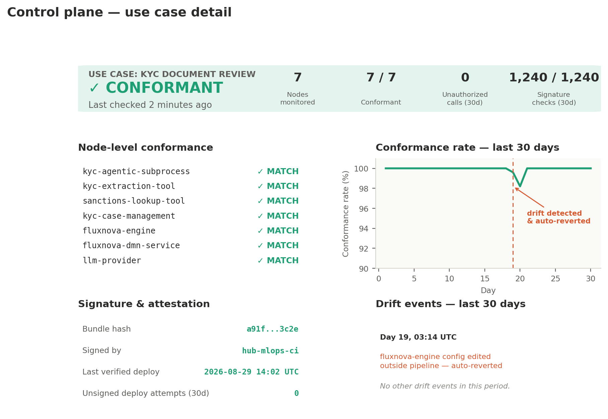

# Chapter 12 — Validating Controls in CI/CD: The KYC Build Gate

Chapter 11 finished building the KYC process: a CALM specification, an agentic ad-hoc subprocess, and a DMN table that is never supposed to auto-clear a sanctions hit. None of that is worth anything if nobody actually checks it before the process reaches production. This chapter is Chapter 7's Step 6 — “embed compliance checks into CI/CD” — and Chapter 2.3's Controls stage, made concrete for the KYC use case specifically: the automated gate that stands between “we built something that should satisfy the risk assessment” and “we've actually confirmed it does.”

## 12.1 Why This Step Exists Between Building and Running

Everything Chapters 9 through 11 produced is a claim: a claim that the CALM file's controls cover every mitigation in the risk shortlist, a claim that the agent's reachable surface matches what the taxonomy approved, a claim that the DMN table really does route every sanctions match to escalation. Claims are cheap to make and expensive to get wrong. The Controls stage exists to turn each of those claims into something mechanically checked before a human ever has to trust it — the same discipline Chapter 4's CI/CD integration already applies to every other change, applied here to the specific artifacts this use case produced.

## 12.2 What Gets Checked, and Against What

- **Structural validation of the CALM file.** Every relationship the Fluxnova process actually uses must be declared in the CALM specification, and nothing the CALM specification declares should go unused — the automated version of the “scope match” check Chapter 10.4 first introduced as a manual review step.

- **Control coverage.** Every mitigation in Chapter 9's risk shortlist must have a corresponding control in the CALM file — the automated version of Chapter 10.4's “coverage” check. A mitigation with no matching control fails the build rather than waiting for a reviewer to notice it's missing.

- **DMN table correctness.** The decision table from Chapter 11.5 gets exercised against every input combination that matters, with the outcome checked against what the linked control actually requires — this is the literal unit test Chapter 11.5 already argued the table's structure makes possible.

## 12.3 A Worked Example: Testing the KYC Build

What this looks like running, for the KYC use case specifically:

```
$ calm validate kyc-agentic-subprocess.calm.json
✓ All nodes declared (4 business nodes, 3 infrastructure nodes)
✓ All relationships reference declared nodes
✓ No undeclared relationship — agent's reachable surface matches
  the taxonomy classification from Chapter 9
 
$ calm controls check --against risk-shortlist.json
✓ no-sanctions-override      control present, linked to RI-KYC-07
✓ mandatory-human-review     control present, linked to RI-KYC-12
✓ token-budget-ceiling       control present
✓ shared-infra-allocation    control present
  4/4 mitigations from the Chapter 9 risk shortlist have a matching
  control
 
$ fluxnova dmn-test kyc-risk-confidence.dmn --cases dmn-test-cases.json
✓ no match, high confidence, low risk        → auto-clear   PASS
✓ no match, high confidence, medium risk     → escalate     PASS
✓ no match, low confidence, any risk         → escalate     PASS
✓ possible match, any confidence, any risk   → escalate     PASS
✓ confirmed match, any confidence, any risk  → escalate     PASS
                                                    (cannot auto-clear)
  5/5 test cases passed — 0 combinations produce an auto-clear
  outcome on a sanctions match
 
BUILD: PASSED — deployment approved
```

The last line of that test matrix is the one worth sitting with. Chapter 9 asserted that a confirmed sanctions match can never resolve to auto-clear; Chapter 11 built a DMN table designed to guarantee it; this is where that guarantee stops being a design intention and becomes a passing test, re-run automatically on every future change to the table, the CALM file, or the risk shortlist that feeds them both.

## 12.4 What Happens on Failure

Any one of these checks failing blocks the build the same way a failing unit test blocks any other software change — the pull request from Chapter 9.4 cannot merge, and the use case cannot progress to Chapter 7's Step 7 deployment. There's no special-casing between a KYC-specific control and a general one drawn from the AIGF catalog: the CI/CD integration treats them identically, which is exactly Chapter 4.1's point about compliance checks running where code already runs. Ownership follows Chapter 7.1's structure directly — Hub MLOps/DevSecOps maintains the pipeline mechanics that run these checks, while the Governance Layer (MRM) is who defines what “pass” actually means for a given control, particularly the DMN test cases a change might need to satisfy.

## 12.5 From CI/CD Gate to Deployment

Once every check passes, what gets deployed is the exact bundle this chapter validated — the CALM specification and the Fluxnova process definition, not a hand-verified approximation of them. But “what passed the gate” and “what's actually running” are two different claims, and everything so far in this chapter only establishes the first one. Section 12.6 closes that gap.

## 12.6 Runtime Conformance: A Control Plane for What's Deployed

Every check in Sections 12.2 through 12.4 runs before merge. That's deliberate — catching a missing control before it ships is far cheaper than catching it after — but it also means those checks are silent about two entirely realistic failure modes: a deployment that doesn't match what was validated, and a live system that drifts away from its validated state sometime after it started running. Neither is hypothetical. A hotfix applied directly to a running Fluxnova engine, a manually edited tool binding, an infrastructure change made outside the normal pipeline — any of these leave the CI/CD gate from Sections 12.2 through 12.4 with nothing to say, because none of them go through it. Closing that gap needs a control plane: something that keeps checking conformance continuously, not just at the moment of merge.

- **Sign the validated bundle, verify the signature at deploy.** Once the CALM specification and Fluxnova process definition pass Section 12.3's checks, hash and sign that exact bundle as a build artifact — the same supply-chain attestation pattern (SLSA, in-toto) used to sign container images. The deployment step then refuses to run anything whose signature doesn't match what was actually validated, which is what stops a hand-edited config from ever reaching production labeled as if it had passed the gate.

- **Diff declared state against live state.** CALM's own tooling already has the mechanism for this: calm-cli ships a diff command that compares two CALM documents — or two moments in a CALM timeline — matching nodes and relationships by their unique identifiers and classifying each change as added, removed, modified, or renamed. Exporting the live Fluxnova engine's actual configuration back into CALM's document format and running it against the git-committed, validated version turns that comparison into a drift check: any difference is something Section 12.3's pre-merge checks couldn't have caught, because it happened after deployment.

- **Make the diff continuous, not a one-off audit.** A single comparison answers “is it conformant right now.” A control plane runs that same comparison on a schedule, or reacts to change events, the way GitOps controllers like ArgoCD or Flux continuously reconcile a Kubernetes cluster against its declared manifests. The KYC use case's CALM file in git is the source of truth; the controller's job is noticing, promptly, whenever the running system stops matching it — and either alerting the Governance Layer or reverting the unauthorized change automatically, depending on how much autonomy the control itself is configured to have.

- **Cross-check declared boundaries against observed behavior.** Chapter 14's observability layer already tags every execution trace with the CALM node and control identifiers involved. That's a second, independent conformance signal, orthogonal to comparing configurations: if any trace ever shows the agentic subprocess invoking a tool call outside its declared relationships, that's drift proven from actual behavior, not from inspecting a config file that might not reflect what's really executing.

- **Push the same validation to the deployment admission point, not just CI.** The checks from Section 12.2 can run a second time as an admission gate on the deployment side itself — the same pattern Kubernetes' OPA/Gatekeeper uses to block a resource that doesn't satisfy policy, applied here to a Fluxnova process definition. This is the backstop for the one scenario none of the above fully covers: a change that skips the normal CI/CD path entirely. An admission gate at the one chokepoint everything has to pass through to actually run catches it regardless of how it got there.



*Figure 7. An illustrative control plane dashboard for the KYC agentic subprocess: overall conformance status, node-by-node comparison against the declared CALM file, signature verification, and a 30-day history showing one drift event caught and auto-reverted.*

Every panel in that dashboard maps to one of the five mechanisms above: the top banner is the single unambiguous status a Governance Layer reviewer actually wants first; the node table is this section's diff, run against every CALM node rather than summarized away; the signature panel is the attestation check from the first bullet; the trend line is what makes the reconciliation loop's history visible rather than only its current state; and the drift log is where a caught-and-reverted change becomes a recorded event instead of a silent non-issue. The one drift event in this illustration — a fluxnova-engine config edited outside the pipeline — is exactly the failure mode this section opened with, shown here as something the control plane actually caught rather than a hypothetical risk.

This screen is scoped to a single use case on purpose — Chapter 15 extends the same control plane with a portfolio-wide home screen and a dedicated tokenomics view, so a use case's conformance status is one tile in a larger picture rather than a standalone tool.

None of this replaces Sections 12.2 through 12.4 — it's the continuous complement to a one-time gate. The CI/CD checks answer “does this pass before it ships.” The control plane answers “is it still true now,” for as long as the KYC process keeps running. Together, they're what makes Chapter 9's original claim — that a confirmed sanctions match can never auto-clear — something an FSI organization can stand behind on any given day, not just on the day the pull request was reviewed.
