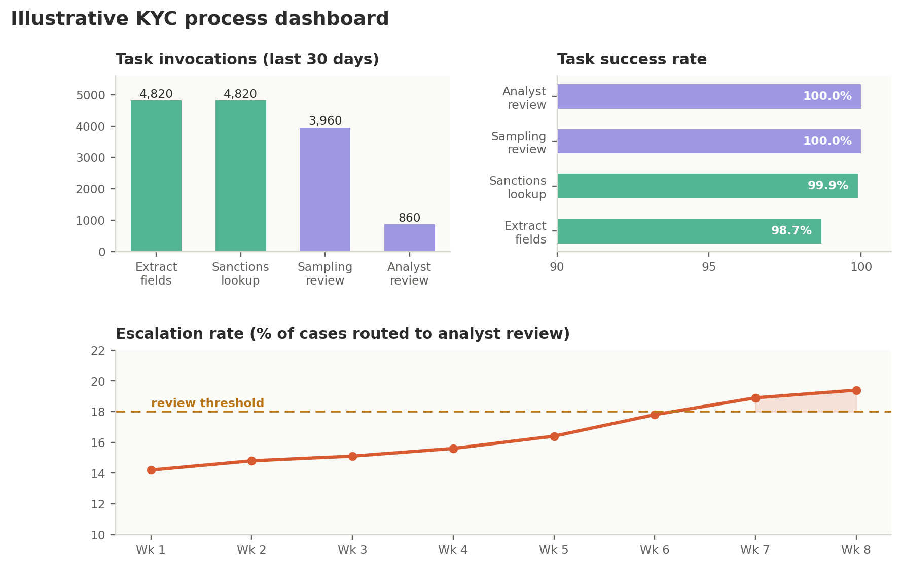

<!--
SPDX-License-Identifier: CC-BY-4.0
Copyright 2026 Fintech Open Source Foundation
-->

# Chapter 14 — Observability in Depth: Evidence, Metrics, and the KYC Process in Production

Chapter 11 ended at the point of deployment, with a one-paragraph promise: every execution gets traced, feeding OpenTelemetry and, eventually, the evals that judge whether the system still behaves as designed. This chapter makes good on that promise in the same depth as Chapters 9 through 11 gave the rest of the build — what observability actually needs to capture once the KYC process is live, how it turns into evidence a regulator or an auditor can use, and how it gives engineering and Governance a shared, factual view of what the deployed system is actually doing.

## 14.1 Two Audiences, One Signal

Observability is often framed as an engineering concern — is the system up, is it fast, is it erroring. That's real, but it's only half of what this pipeline needs. The other half is Governance's question from Chapter 5: not just is it working, but can we prove the controls held. The value of building observability on top of Fluxnova's execution traces (Chapter 11) rather than as a separate bolt-on is that both questions get answered from the same underlying data. An engineer watching latency and an MRM analyst confirming that a sanctions match never auto-cleared are querying the same trace store, not two disconnected systems that happen to sit next to each other.

## 14.2 The Three Signals: Traces, Metrics, and Logs

OpenTelemetry, introduced in Chapter 1's pipeline diagram, organizes observability data into three kinds of signal, and the KYC process produces all three:

- **Traces** capture the full execution path of a single case: which tasks ran, in what order, which gateway fired, and how long each step took. A trace is the answer to “what happened to this specific case” — exactly the granularity Chapter 11's determinism argument depends on being reconstructable.

- **Metrics** aggregate traces into counts and rates across many cases: how many times a task ran, what fraction succeeded, how long it typically takes. Metrics are what turn thousands of individual traces into a small number of numbers a dashboard can show at a glance.

- **Logs** capture event-level detail inside a step — a tool call's input and output, an error message, a retry. Logs are where an engineer goes after metrics or a trace has pointed at a specific case or task that needs a closer look.

None of this is specific to agentic systems — it's the same three-signal model any well-instrumented service uses. What makes it relevant to governance is what gets tagged onto each signal: a trace or a log line associated with a Fluxnova execution carries the CALM node and control identifiers from Chapter 10, so a query for “every case where the no-sanctions-override control was evaluated” is a normal query against normal observability data, not a special-purpose audit system.

## 14.3 Task Executions: Success Rate, Duration, and Invocation Counts

At the metric level, every task in the KYC process — the two agent tool calls, the DMN gateway, the two human review tasks — gets tracked the same way: how often it runs, how often it succeeds, and how long it takes. This is the concrete, per-task view of the process Chapter 11 modeled:

| **Task**                              | **Invocations (30d)** | **Success rate** | **Avg. duration** | **P95 duration** |
|---------------------------------------|-----------------------|------------------|-------------------|------------------|
| **Extract KYC fields (tool)**         | 4,820                 | 98.7%            | 2.1s              | 4.8s             |
| **Sanctions / PEP lookup (tool)**     | 4,820                 | 99.9%            | 0.8s              | 1.6s             |
| **Risk & confidence gateway (DMN)**   | 4,820                 | 100.0%           | 0.02s             | 0.04s            |
| **Sampling review (human, async)**    | 3,960                 | 100.0%           | 1.4 days          | 3.1 days         |
| **Analyst review (human, mandatory)** | 860                   | 100.0%           | 6.2 hours         | 1.8 days         |

A few things worth reading off this table. The two agent tool calls run on every case (4,820 invocations, matching total case volume) and complete in seconds, which is expected for a bounded tool call. The sampling review and analyst review run far less often — 3,960 and 860 times respectively — because they're the two branches of the gateway from Chapter 11, and their durations are measured in hours and days rather than seconds, because they wait on a human. A success rate below 100% for the agent tasks (98.7% for extraction) isn't itself alarming — it reflects retried failures like a malformed upload — but a sustained drop would be exactly the kind of signal that triggers the review Section 14.6 describes. The two human tasks show 100% success by construction: Fluxnova doesn't record a human task as complete until a reviewer has actually recorded a decision, so there's no partial or malformed outcome to measure.

This is also where the agentic ad-hoc subprocess's tool-bounded design (Chapter 11) pays off for observability specifically. Because the LLM's only actions are the two listed tools, every invocation the metrics table counts is a tool call this table already expected — there's no category of “the agent did something else” to account for, because the subprocess boundary doesn't allow it.

## 14.4 Evidence of Control Usage: Proving the Mitigations Held

Metrics on tasks answer an operational question. This section answers Chapter 5's compliance question directly: not just that the process ran, but that the specific controls from Chapter 10 actually did what they were supposed to, every time. Because each control carries its identifier through the CALM specification and into the DMN table (Chapter 11), the evidence is a straightforward query against the same trace data — how many times was this control evaluated, how many times did it trigger, and did the outcome match what the control requires:

| **Control**                | **Times evaluated** | **Times triggered**                      | **Verified outcome**                                     |
|----------------------------|---------------------|------------------------------------------|----------------------------------------------------------|
| **no-sanctions-override**  | 4,820               | 142 (confirmed or possible match)        | 100% routed to escalation — zero auto-clears on a match  |
| **mandatory-human-review** | 4,820               | 860 (below confidence or risk threshold) | 100% held for analyst review before any outcome recorded |

This table is the literal answer to the claim Chapter 9 made when it said a confirmed sanctions match can never reach an auto-clear outcome. It's not an assertion about the DMN table's design anymore — it's a count, over 4,820 real cases, confirming that every one of the 142 cases where the control triggered was actually routed to escalation. This is precisely the kind of evidence Chapter 6 described AIUC-1's adversarial testing and audit process wanting to see, and precisely what an internal audit or a regulator examining the KYC process would ask for first.

## 14.5 Dashboards for Different Audiences



*Figure 5. An illustrative KYC process dashboard: task-level invocation counts and success rates alongside a compliance-relevant trend — the escalation rate crossing a review threshold over eight weeks.*

Chapter 1's pipeline diagram showed dashboards as a single node with two views — operational and compliance — and this figure shows both at once, because in practice they're built from the same data and often live on the same screen. The top two panels are the operational view: how much volume is moving through each task, and how reliably. The bottom panel is the compliance-relevant one: the escalation rate — the share of cases routed to a human rather than auto-cleared — tracked over time against a review threshold Governance set in advance.

The trend in that bottom panel is deliberately drawn crossing the threshold, because that's the scenario Section 14.6 exists to describe. A rising escalation rate isn't automatically a problem — it might mean the DMN table's thresholds from Chapter 11 are working exactly as intended against a genuinely riskier mix of cases. But it's also exactly the kind of drift Chapter 11's closing paragraph warned about, and the dashboard's job is to surface it as a visible trend well before it becomes a compliance incident, not to render a verdict on its own.

## 14.6 From Observability to the Feedback Loop

This is Step 8 from Chapter 7, made concrete. When the escalation rate in Section 14.5 crosses its threshold, that's not the end of the story — it's the trigger for exactly the review Chapter 7's Step 8 task list assigns to the Governance Layer, with Business Spoke AI engineering support. The investigation starts with the same data this chapter has already described: pull the traces for cases escalated in the weeks the rate climbed, check whether they cluster around a specific input pattern the original risk assessment (Chapter 9) didn't anticipate, and decide whether the finding changes the DMN table's thresholds (Chapter 11), the risk catalog (Chapter 9), or both.

Whatever the finding, it feeds back into the same artifacts this guide has built throughout: a revised DMN table gets the same CI/CD-enforced review any other change gets (Chapter 4), a revised risk mapping updates the CALM controls it's linked to (Chapter 10), and if the finding is significant enough to matter beyond this one use case, it's a candidate for contribution back to AIGF itself, exactly as Chapter 9 described for the original KYC pull request. This is also, concretely, the evidence base Chapter 7's Step 9 and Chapter 6's AIUC-1 discussion both depend on: an FSI organization deciding whether to pursue external certification, or preparing for a quarterly re-audit, is drawing on the same task metrics and control evidence tables this chapter just walked through — not compiling them for the first time under deadline pressure.

## 14.7 Generating Compliance Reports: Per-Case and Aggregate

Everything this chapter has described — traces, task metrics, control evidence — is queryable data, which means a compliance report isn't a document someone writes; it's a document the pipeline assembles on request. Two report shapes cover most of what Governance actually needs, and both are generated from the same underlying trace store described in Section 14.2, not compiled by hand from separate sources.

### A single-case report

The narrowest and most common request is: show me exactly what happened on this one case — for a customer complaint, a spot-check from an examiner, or a follow-up on a specific escalation. Because every task, gateway, and control evaluation in the KYC process carries the identifiers from Chapters 10 and 11, this report is a direct query against a single trace, not a reconstruction:

```
KYC CASE COMPLIANCE REPORT
Case ID: KYC-2026-0483217
Generated: 2026-08-31 14:32 UTC (on demand)
 
USE CASE        KYC document review (agentic ad-hoc subprocess)
CALM SPEC       kyc-agentic-subprocess v3.2
FLUXNOVA PROC   kyc-review-v3 (deployed 2026-06-11)
 
EXECUTION PATH
  1. Document received                      14:00:02
  2. Extract KYC fields (tool)               14:00:04              success, confidence 0.97
  3. Sanctions / PEP lookup (tool)           14:00:05              success, match: none
  4. Risk & confidence gateway (DMN)         14:00:05              outcome: escalate (risk band: medium)
  5. Analyst review (human, mandatory)       14:00:05 → 18:42:11   assigned: J. Alvarez
  6. Case cleared                            18:42:11
 
CONTROLS EVALUATED
  no-sanctions-override     evaluated: yes  triggered: no   outcome: n/a, no match found
  mandatory-human-review    evaluated: yes  triggered: yes  outcome: held for review;
                                                             cleared by analyst
 
AUDIT TRAIL
  Trace ID: 7fae2c1e-4b9a-4e2d-8f13-2c5a9b31d0e7
  Retained per data retention policy: 7 years
```

Notice what this report doesn't require: nobody went back through logs to reconstruct what happened, and nobody had to explain the DMN table's logic from memory. Every line is a direct readout of data the process generated as it ran — which is the same “evidence as a byproduct, not a project” point the Introduction and Chapter 6 both make, now shown as an actual artifact rather than an argument.

### An aggregate report, across all instances

The second shape answers a broader question — not what happened on one case, but how the process behaved as a whole over a period — the kind of report a monthly Governance review, a board update, or an AIUC-1 quarterly re-audit (Chapter 6) actually needs. It's assembled from the same data as the single-case report, aggregated rather than filtered to one trace, and it draws directly on the tables and figure already built in this chapter:

- **Executive summary** — period covered, total case volume, and the headline numbers a reader wants first: overall success rate, escalation rate, and whether either moved outside its expected range.

- **Task-level performance** — the same shape as Section 14.3's table, for the period in question: invocation counts, success rates, and durations for every task in the process.

- **Control evidence** — the same shape as Section 14.4's table: how many times each control was evaluated, how many times it triggered, and confirmation that every triggered instance resolved the way the control requires.

- **Trend and anomalies** — built from the same dashboard in Section 14.5: whether the escalation rate crossed its review threshold during the period, and if so, a note on whether Section 14.6's investigation was opened and what it found.

- **Certification readiness** — for a use case where Chapter 7's Step 9 decision was to pursue AIUC-1, a note on whether this period's evidence is consistent with the certification already granted, or whether drift noted above warrants flagging ahead of the next quarterly re-audit.

Both reports exist for the same reason: because the underlying data is structured and queryable from the moment the process runs, generating either one is a matter of asking the right question of data that already exists — not a research project that starts when someone asks for it.
