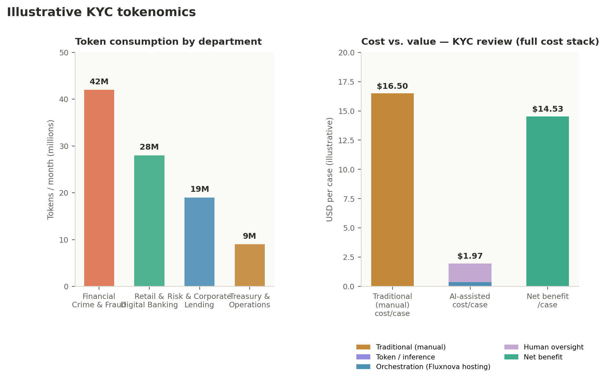
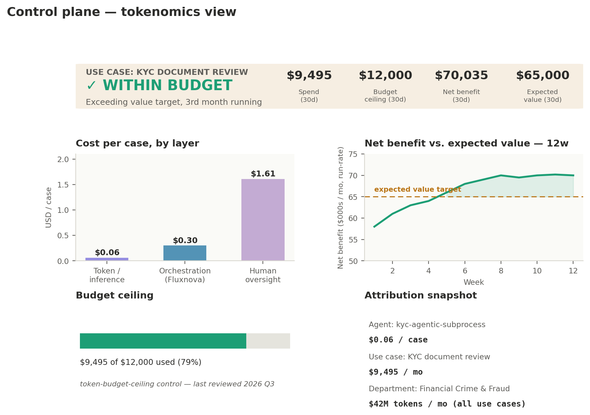
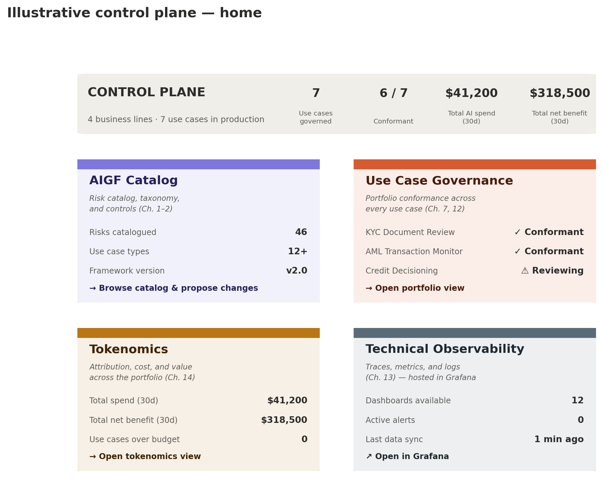

# Chapter 15 — Tokenomics: Attribution, Cost, and Value

Chapter 14 gave every task in the KYC process a cost dimension almost in passing — the observability layer's job, per Chapter 1's diagram, includes cost tracking alongside behavior. This chapter takes that dimension seriously on its own terms. Tokenomics is not the same question as “how many tokens did we spend this month” — that number, on its own, tells an FSI organization almost nothing useful. The real questions are who spent them, on what, and whether what they bought was worth more than it cost.

## 15.1 Tokenomics Is an Attribution Problem, Not a Metering Problem

A single aggregate token bill is a finance line item, not a governance signal. It can't tell a CAIO whether the Financial Crime & Fraud spoke's spend is concentrated in one runaway use case or spread evenly across five healthy ones, whether a given agent's cost per case is trending up because of genuine complexity or a badly-tuned prompt, or whether the institution is spending more on a use case than that use case is worth. Getting from a bill to an answer requires attributing every token to three things at once: the specific agent that spent it, the specific use case it ran inside, and the specific department that owns that use case. Miss any one of those three and the number is close to meaningless — a department-level total with no use-case breakdown hides a single expensive outlier; a use-case total with no agent breakdown hides which specific tool call or prompt is driving cost.

This isn't a problem an FSI organization needs to solve alone or from a blank page. In August 2026, the Linux Foundation launched the Tokenomics Foundation — a vendor-neutral body, backed by JPMorganChase, BNY, SAP, ServiceNow, IBM, and two dozen others, building open standards for exactly this: shared definitions for token value and density, a reference model for the full cost of AI, and standardized cost telemetry contributed into FOCUS, the FinOps Foundation's existing cost-and-usage specification. The relationship to this guide's argument is direct: the same case Chapter 2 makes for AIGF over a proprietary risk framework applies here — an FSI organization's internal tokenomics practice should align to this emerging open standard as it matures, rather than inventing its own token taxonomy the way it shouldn't invent its own risk taxonomy.

One caution worth setting expectations with early: falling per-token prices do not mean falling total AI spend. Industry analysis has projected inference costs continuing to drop through the rest of the decade, and enterprise AI spend has continued rising anyway — usage and workload complexity grow faster than efficiency gains reduce unit cost. A CAIO reporting to a board should expect this pattern rather than be caught by it: the goal of tokenomics is not to make the bill shrink, it's to make sure the bill's growth stays tied to growing value.

## 15.2 Three Axes of Attribution: Agent, Use Case, Department

- **By agent.** Within a single use case, different agentic subprocesses — or different tool calls inside the same subprocess — consume tokens differently. In the KYC example, the agentic ad-hoc subprocess's own reasoning, its call to the extraction tool, and its call to the sanctions lookup tool are three distinguishable consumers, not one lump sum, because each is already a separately identified node in the CALM specification from Chapter 10.

- **By use case.** Aggregating across every instance of one process — every KYC case run in a month — gives the number a Business Spoke actually manages against: what does running this use case cost, in total and per case, and is that trending in a direction anyone approved.

- **By department.** Aggregating across every use case a given Business Spoke runs — not just KYC, but every agent Financial Crime & Fraud operates — gives the Hub and the Governance Layer the number that actually matters for budget and prioritization conversations: which parts of the hub-and-spoke structure from Chapter 7 are consuming the shared model infrastructure, and how that maps to the value each of them is producing.

None of these three views replaces the others. An FSI organization that only tracks department-level spend can't see that one agent inside Financial Crime & Fraud is responsible for the department's entire increase; an FSI organization that only tracks per-agent spend can't roll that up into a departmental budget conversation. The three axes are the same underlying data, sliced three ways.

## 15.3 Tagging Consumption at the Source

This isn't a separate tracking system bolted on after the fact — it's the same tagging mechanism Chapter 14 already described for control evidence, extended to carry one more field. Every CALM node from Chapter 10 already has a unique identifier; every Fluxnova trace from Chapter 11 already carries that identifier through execution. Attributing tokens by agent is a matter of recording token counts against the same kyc-agentic-subprocess, kyc-extraction-tool, and sanctions-lookup-tool identifiers already in use — not inventing a new namespace. Attributing by use case and department follows the same path one level up: the use case's taxonomy classification from Chapter 9 already names which Business Spoke owns it, so a token count tagged to a use case is already, transitively, tagged to a department. The practical implication is that tokenomics doesn't require new infrastructure so much as one additional field on data the pipeline is already generating.

## 15.4 Beyond Tokens: The Full Cost of AI

Token counts are the easiest number to get and the most incomplete one to stop at. Industry cost analysis of enterprise AI deployments consistently finds that compute and inference are only about half of total AI spend — the rest is storage, networking, power and facilities, and the operational labor of running the platform. A tokenomics practice that only ever reports token counts is, in effect, reporting roughly half the bill. The full picture has three layers, and the KYC use case already has a named node for each of the first two, from Chapter 10's CALM specification:

- **Token / inference cost** — the llm-provider node: a near-pure marginal cost that scales directly with case volume, exactly what Sections 13.1 through 13.3 already attribute.

- **Orchestration cost** — the fluxnova-engine node. Fluxnova itself is license-free, open-source software — but running it is not free. Someone hosts the compute and storage the engine runs on, someone (Hub MLOps/DevSecOps, per Chapter 7.1) keeps it patched and scaled, and an FSI organization may choose to pay a FINOS-affiliated service provider (Chapter 8.2) for a support contract. Unlike token cost, this is closer to a fixed cost: it scales with infrastructure capacity, not with how many KYC cases ran this month.

- **Operational / oversight cost** — the human review time already in Chapter 14's task metrics table: analyst hours spent on escalated cases.

The fixed-versus-marginal distinction between the first two layers matters for a reason beyond precision. Because Fluxnova is Hub-owned, shared infrastructure — the same “build once, reuse across every use case” asset Chapter 7 already describes for the taxonomy and reference architectures — its hosting and support cost is naturally amortized across every use case running on it, not paid fresh by each one. That's a second, cost-side version of Chapter 7's argument that an FSI organization's second and third use cases move faster than its first: they're also cheaper per case, because they share infrastructure whose cost is already sunk.

### The buy-versus-host decision

The llm-provider node itself represents a choice worth surfacing explicitly rather than leaving implicit in a configuration field: whether the FSI organization calls a model through a metered API, or hosts and serves its own models on owned infrastructure. Industry TCO modeling finds a real inflection point in this decision — below roughly 70 to 85 billion tokens a year, pay-as-you-go API access tends to be more cost-effective; above it, self-hosted infrastructure's fixed costs are spread over enough volume to win out, at the price of the capital investment and operational maturity self-hosting demands. This isn't a decision to make once and forget — it's exactly the kind of architectural choice Chapter 10's architecture review (Section 10.4) should revisit periodically as a use case's volume grows, the same way Chapter 7's Step 8 revisits a DMN table's thresholds as production evidence accumulates.

## 15.5 From Consumption to Value: The Net Benefit Equation

Attribution and full-cost accounting answer what something costs. They don't answer whether it was worth running. That question needs a business value figure to set against the cost, and the comparison that actually matters isn't the AI system's cost in isolation — it's the AI system's cost against what the same work would have cost the traditional way. Stated plainly:

- **Net AI value = (cost of the traditional approach) − (full cost of the AI-assisted approach).**

The full cost of the AI-assisted approach is now Section 15.4's three layers together: token cost, amortized orchestration cost, and remaining human oversight cost. The cost of the traditional approach is what fully manual review of the same volume would have cost in analyst time alone. A second, complementary value metric is worth tracking alongside the dollar figure — the Tokenomics Foundation's own roadmap proposes measuring AI value starting with the share of work completed without human involvement, set against what that work costs today. The KYC process already has this number: Chapter 14's escalation rate means roughly 82.2% of cases clear without ever reaching a human reviewer. That figure and the dollar-based net benefit are two views of the same underlying success, and an FSI organization reporting both gives a board a number it can also compare against how other institutions and other use cases are doing, once the Tokenomics Foundation's benchmarks mature.

## 15.6 A Worked Example: KYC Tokenomics

Putting real illustrative numbers against the framework, using the same case volume Chapter 14 worked with (4,820 cases over 30 days, roughly 17.8% escalated to analyst review):



*Figure 6. Illustrative KYC tokenomics: token consumption attributed by department (left), and the full cost stack — token, orchestration, and human oversight — set against the traditional approach and the resulting net benefit (right).*

The left panel is Section 15.2's department axis made concrete — Financial Crime & Fraud, where the KYC use case lives, carries the largest share of token consumption in this illustration, but the breakdown lets the Hub see immediately that this isn't spread evenly, and lets Governance ask a specific, answerable question if that concentration looks wrong rather than an unanswerable one about a single combined total.

The right panel is Section 15.5's equation worked through with the full cost stack from Section 15.4, not tokens alone. A fully manual KYC review, at roughly 22 minutes of analyst time per case, costs approximately $16.50 per case in analyst time alone. The AI-assisted process costs a small fraction of a cent per case in tokens, roughly $0.30 per case in amortized Fluxnova hosting and support, and analyst time only for the 17.8% of cases that reach mandatory review — blending to roughly $1.97 per case across the full volume once every layer is counted. The net benefit, per case, is the difference: approximately $14.53 — modestly lower than a token-only estimate would suggest, but a more defensible number, since it doesn't quietly omit real infrastructure cost the way a token-only figure would. At 4,820 cases a month, that's a meaningful monthly figure an FSI organization can put next to the pipeline's build and run costs from Chapter 7's timeline and decide, with an actual number rather than an assumption, whether this use case earned its investment.

Every figure in this example is illustrative, not a claim about what any specific institution should expect — the point is the shape of the calculation, not these particular dollar amounts. An FSI organization running this for real replaces the assumed manual review time, the token pricing, the Fluxnova hosting allocation, and the analyst cost rate with its own numbers, but the structure of the comparison doesn't change.

## 15.7 Governing Cost the Same Way We Govern Risk

Everything in Chapters 9 and 10 established a pattern: a risk gets a control, a control gets a requirement and a configuration, and the pair lives in the CALM specification where it's reviewed like any other change. Cost governance follows exactly the same pattern rather than needing a separate mechanism — the FinOps discipline of budget alerts, usage caps, and chargeback tagging is just another control, expressed the same way:

```
{
  "nodes": [
    {
      "unique-id": "kyc-agentic-subprocess",
      "node-type": "service",
      "name": "KYC document review (agentic ad-hoc subprocess)",
      "controls": {
        "cost-governance": {
          "description": "Token budget ceiling for this use case, reviewed quarterly against Section 15.6's actuals",
          "requirements": [
            {
              "control-requirement-url": "https://fsi.example/controls/schema/token-budget-ceiling.json",
              "control-config-url": "https://fsi.example/controls/config/kyc-token-budget-2026q3.json"
            }
          ]
        }
      }
    },
    {
      "unique-id": "fluxnova-engine",
      "node-type": "system",
      "name": "Fluxnova orchestration engine",
      "controls": {
        "cost-allocation": {
          "description": "Shared-infrastructure hosting and support cost, amortized across every use case this engine runs",
          "requirements": [
            {
              "control-requirement-url": "https://fsi.example/controls/schema/shared-infra-allocation.json",
              "control-config-url": "https://fsi.example/controls/config/fluxnova-hosting-allocation-2026q3.json"
            }
          ]
        }
      }
    }
  ]
}
```

Two things are worth noting about this pair of controls. The first, on the agent node, is a hard ceiling — the kind of guardrail that can block a release the same way a failing compliance check does in Chapter 4's CI/CD integration, catching a runaway prompt or an unbounded reasoning loop before it becomes next month's surprise bill. The second, on the Fluxnova engine node itself, isn't a limit so much as an allocation rule — it's what makes Section 15.4's amortization concrete and auditable rather than a one-off spreadsheet calculation, giving even a “free” open-source component an explicit, reviewable cost tag in the same file where its business-logic behavior is governed.

## 15.8 Building Value Accountability into the Pipeline

This connects back to the pipeline itself, not just to a reporting exercise sitting alongside it. Chapter 9's Step 1 already asks a team to write a use case narrative before anything is built; an FSI organization serious about tokenomics extends that narrative with a stated expected value — what this use case is supposed to save or generate, and roughly how, before a single CALM node exists. That single addition is what turns Section 15.6's report from a retrospective curiosity into an accountability mechanism: the use case's actual net benefit, measured continuously through the same observability layer Chapter 14 already built, can be compared against the value it was approved on the strength of. A use case that's tracking well below its stated expected value is exactly the kind of finding that belongs in Chapter 7's Step 8 feedback loop alongside a drifting escalation rate — not a compliance problem, but a value problem the same continuous-monitoring discipline is well suited to catch.

This is also, ultimately, why tokenomics belongs in a governance guide at all rather than being left entirely to finance. Chapter 6 argued that AIGF's evidence supports an FSI organization's case for AIUC-1 certification when it's warranted; this chapter's evidence supports the parallel case an institution has to make to itself — not just that a use case is compliant and reliable, but that building it was the right call in the first place, with a number attached rather than an assumption. And as the Tokenomics Foundation's own standards mature, that number stops being an FSI organization's own private calculation and starts being one it can compare against an industry benchmark — the same trajectory AIGF has already run for risk.

## 15.9 A Control Plane Screen for Tokenomics

Chapter 12's control plane was built to answer one question continuously: does the deployed system still match what was declared. Tokenomics deserves the same continuous treatment rather than living only in the monthly-report format Section 15.6 walked through — a budget that quietly overruns for three weeks before anyone notices it is a governance gap of exactly the same shape as a control silently failing to fire.



*Figure 8. A tokenomics screen in the same control plane: live cost-per-case by layer, net benefit tracked continuously against the expected value stated at Step 1, and a budget ceiling shown as a live position rather than a monthly surprise.*

This is the same status-first pattern as Figure 7, applied to cost and value instead of structural conformance. The banner leads with the one judgment that matters — within budget or not — the same way Figure 7 leads with conformant or not. The budget ceiling panel is Section 15.7's token-budget-ceiling control made visible as a live position rather than something only checked at CI/CD time; the net benefit trend is Section 15.8's accountability argument made continuous, showing the use case tracking above its stated expected value for three consecutive months rather than requiring someone to compile that comparison by hand. And because every figure here is attributed by agent, use case, and department per Section 15.2, the same screen is also where a Governance Layer reviewer would go to answer “why did this month's spend move” without waiting for the next scheduled report.

## 15.10 One Control Plane, Four Views

Chapters 1, 2, 12, 14, and this chapter have each described a different lens on the same underlying system — the risk catalog, the deployed conformance state, the operational telemetry, and now cost and value. None of them needs to live in a separate tool a Governance Layer reviewer has to remember to check. What ties them together is a single entry point:



*Figure 9. A portfolio-level home screen for the control plane: one launcher into the AIGF catalog, use case governance across the whole portfolio, tokenomics, and technical observability.*

The four tiles are deliberately not four different products. The AIGF Catalog tile is a window onto the same risk-and-taxonomy content Chapter 2 described — with a path to propose a change back to it, the same contribution flow Chapter 9 walked through for the original KYC pull request. The Use Case Governance tile is Figure 7's per-use-case conformance screen, rolled up to portfolio level, so a reviewer sees every use case's status at a glance before drilling into one. The Tokenomics tile is Figure 8, similarly rolled up across the whole portfolio rather than scoped to a single use case. And Technical Observability is deliberately an outbound link rather than a fourth native screen — Chapter 14's dashboards, wherever an FSI organization already hosts them (Grafana being the common choice this guide has referenced throughout), stay exactly where they are. The control plane's job is to be the one place that knows those dashboards exist and route a reviewer to them, not to rebuild an operational monitoring tool that already does its job well.

This is also where the argument from Chapter 1 closes all the way around. The pipeline's five stages, the fragmented inputs feeding them, the Controls-stage checks from Chapter 12, and the cost-and-value accounting from this chapter are not four separate initiatives an FSI organization happens to be running at once — they're four views onto one governed system, and a control plane home screen is simply what makes that fact visible to the people who have to act on it.
